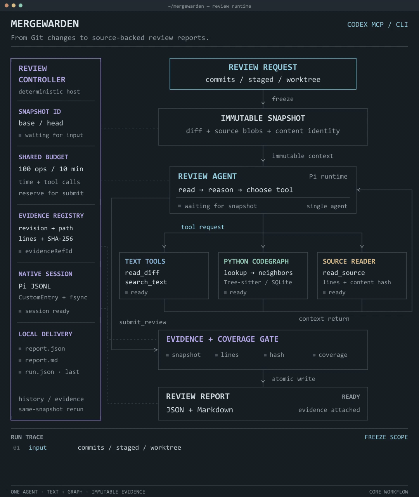

# MergeWarden

> 在 Codex 或终端中审查代码变更，追踪跨文件依赖，获取有源码证据的风险报告。

MergeWarden 是面向开发者的 AI 代码审查工具。它从 Git 提交、暂存区或工作区变更出发，查找相关实现与调用上下文，检查行为变化和接口约定，并输出包含问题、触发条件、影响及源码位置的审查报告。

安装 Codex 插件后，可以直接在对话中发起审查、查看进度并核查证据；也可以通过 CLI 运行审查，将 JSON / Markdown 报告接入本地工作流。

[Codex 插件安装](#codex-plugin) · [CLI 快速开始](#quick-start) · [性能表现](#performance) · [常用命令](#commands) · [下载发布包](https://github.com/takagibit18/MergeWarden/releases/tag/codex-plugin-v0.1.0) · [项目主页](https://merge-warden.vercel.app)

## 为什么使用 MergeWarden

代码审查不止是检查修改的几行。一次参数调整可能影响调用方，一次继承变化可能破坏子类约定，一次返回值修改可能改变其他模块的行为。MergeWarden 围绕这些依赖关系寻找上下文，并将结论关联到可直接核查的源码。

它适合：

- **提交前审查：** 检查暂存区与已保存的工作区变更。
- **合并前审查：** 比较指定 Git 提交，梳理变更引入的行为风险。
- **跨文件契约检查：** 追踪调用、继承和导入关系，核对调用方与实现是否一致。
- **审查结果复核：** 查看历史报告、读取具体证据，并对同一份代码快照重新审查。

## 核心能力

### 以行为变化为中心的代码审查

审查 Agent 读取差异、搜索相关实现并核对源码，将问题描述、触发条件、严重程度、影响和证据位置整理为结构化结果。报告同时记录已审查的文件范围，便于结合实际修改逐项确认。

### Python CodeGraph 结构导航

使用 Tree-sitter 解析 Python 代码，组织文件、类、函数及其调用、继承和导入关系。Agent 可以将文本搜索与图查询结合，从变更位置定位相关声明和依赖源码，检查跨文件接口约定。

图按源码快照管理，按需构建并复用 SQLite 索引。图提供导航线索，源码读取提供最终证据；关系查询与文本搜索共同服务于同一次审查。

### 可追溯的源码证据

每条证据关联代码版本、文件路径、行号范围和内容摘要。报告保存后，可以通过 `evidence` 命令重新读取当时的源码，不受后续工作区修改影响。引擎检查引用范围与内容完整性，让审查结论能够回到明确的代码位置。

### 可配置的审查预算

通过时间和工具操作预算控制审查投入，接近上限时进入收尾阶段，为最终报告保留提交空间。原生会话记录工具调用和 Token 用量，便于分析审查过程及成本。

### 本地报告与审查记录

审查结果以 JSON 和 Markdown 两种格式保存，并附带运行信息。CLI 提供历史查询、证据读取、同快照重跑和运行诊断；退出码区分正常完成、配置错误与未完成审查，方便接入本地脚本。

CLI 的 [Review Skills](docs/REVIEW_SKILLS.md) 可从审查记录与反馈中整理仓库级检查方法，供后续审查按需读取。文档提供反馈、停用、回滚和恢复命令。

<a id="codex-plugin"></a>

## Codex 插件

通过 `mergewarden` 插件，在 Codex 对话中发起审查、查看状态、读取源码证据和查询历史记录。插件包含 `mergewarden-review` skill 与本地 MCP 服务。

准备 **Node.js 22.19+、Git、npm**，以及支持插件命令的本地 Codex 客户端。以下安装命令已用 Codex CLI **0.159.2** 验证；需要安装 CLI 时可运行：

```sh
npm install -g @openai/codex@0.159.2
```

### 1. 安装插件

从 GitHub 安装发布版本：

```sh
codex plugin marketplace add takagibit18/MergeWarden --ref codex-plugin-v0.1.0
codex plugin add mergewarden@mergewarden
```

### 2. 配置仓库和模型

打开新的 Codex 会话，输入：

> 使用 $mergewarden-review 帮我完成首次配置，审查当前仓库，使用 openai-codex OAuth，先列出可用模型供我选择。

Skill 会安装运行依赖，引导选择本地仓库、供应商和模型，并检查配置。已有明确的仓库路径或模型 ID 时，可在对话中直接指定。

MergeWarden 使用独立的模型授权。OAuth 登录按终端提示完成，模型访问权限和额度由授权账号决定；审查模型通过 MergeWarden 配置，与 Codex 对话中选择的模型分别管理。配置完成后重启 Codex 或打开新会话，使 MCP 服务加载仓库和模型设置。

### 3. 开始审查

在 Codex 中输入：

```text
用 MergeWarden 审查当前仓库的暂存区变更。
用 MergeWarden 审查当前仓库已保存的工作区变更。
用 MergeWarden 比较提交 BASE_SHA 和 HEAD_SHA，并核查问题的源码证据。
```

审查 PR 时，需要在本地 Git 仓库中取得真实的 base/head 提交，并将插件配置到该仓库。Codex 会启动审查任务、查询进度并核查报告中的源码证据，分别呈现完成、无变更或未完成的结果。按 Codex 提示授权工具调用即可。

### 手动配置与维护

运行 `codex plugin list --json` 查看安装目录，在该目录中执行：

```sh
node --experimental-strip-types scripts/codex-plugin.mjs models --provider openai-codex
node --experimental-strip-types scripts/codex-plugin.mjs setup --repo /absolute/my-repo --provider openai-codex --model MODEL_ID --auth oauth
node --experimental-strip-types scripts/codex-plugin.mjs login
node --experimental-strip-types scripts/codex-plugin.mjs doctor
```

`setup` 安装运行依赖并保存仓库和模型配置，`doctor` 检查依赖、仓库和授权状态。一个配置绑定一个本地仓库；切换仓库或模型时，重新运行 `setup` 并重启会话。

API Key 用户在 `setup` 中用 `--api-key-env MERGEWARDEN_API_KEY` 替代 `--auth oauth`，并在启动 Codex 的环境中设置该变量。配置文件只保存变量名。模型目录用于查找模型 ID，实际访问权限以供应商账号为准。

配置与运行数据保存在被审仓库之外。可用 `MERGEWARDEN_PLUGIN_CONFIG` 指定配置文件的绝对路径，用 `--state` 指定数据目录。更新插件后，在安装目录运行 `node --experimental-strip-types scripts/codex-plugin.mjs prepare` 安装依赖，再重启会话。代理、自定义 API Key 变量和独立 MCP 配置见 [MCP 接入指南](integrations/mcp/README.md)。

### 从发布包安装

从 [GitHub Release](https://github.com/takagibit18/MergeWarden/releases/tag/codex-plugin-v0.1.0) 下载 ZIP，解压到普通目录后安装：

```sh
codex plugin marketplace add /absolute/MergeWarden
codex plugin add mergewarden@mergewarden
```

发布页提供 `SHA256SUMS.txt`，可用 `sha256sum` 或 PowerShell 的 `Get-FileHash -Algorithm SHA256` 核对文件。首次配置需要联网下载运行依赖。

<a id="quick-start"></a>

## CLI 快速开始

需要 **Node.js 22.19+、Git 和 npm**。获取发布版本并安装依赖：

```sh
git clone --branch codex-plugin-v0.1.0 --depth 1 https://github.com/takagibit18/MergeWarden.git
cd MergeWarden
npm run setup
npm run cli -- help
```

### 1. 配置模型访问

支持 API Key 和 OAuth 登录。使用 OpenAI Codex OAuth 时：

```sh
npm run cli -- login --provider openai-codex
npm run cli -- auth-status --provider openai-codex
npm run cli -- models --provider openai-codex
```

按终端提示完成授权，并从模型目录中选择账号可访问的 `MODEL_ID`。

### 2. 审查提交

```sh
npm run cli -- review --repo /path/to/repository --base BASE_SHA --head HEAD_SHA --provider openai-codex --model MODEL_ID --auth oauth
```

将仓库路径、两个提交和模型 ID 替换为实际值。运行结束后，终端输出包含报告路径的 JSON 结果；审查进度单独输出，便于脚本读取结果。

### 3. 查看报告与证据

```sh
npm run cli -- history
npm run cli -- show --run RUN_ID
npm run cli -- evidence --run RUN_ID --finding FINDING_ID
```

`show` 查看已保存报告，`evidence` 读取指定问题关联的源码。

### 使用 API Key

在当前终端中设置 `MERGEWARDEN_API_KEY` 环境变量，再指定供应商和模型：

```sh
npm run cli -- review --repo /path/to/repository --base BASE_SHA --head HEAD_SHA --provider PROVIDER --model MODEL_ID --api-key-env MERGEWARDEN_API_KEY
```

API Key 从明确指定的环境变量读取。OAuth 凭据独立保存在应用数据目录中，并通过 `--auth oauth` 选择使用。

<a id="commands"></a>

## 常用命令

以下示例使用 OAuth；使用 API Key 时，将认证参数替换为 `--api-key-env MERGEWARDEN_API_KEY`，并选择对应的供应商与模型。

### 审查暂存区或工作区

```sh
npm run cli -- review --repo /path/to/repository --scope staged --provider openai-codex --model MODEL_ID --auth oauth
npm run cli -- review --repo /path/to/repository --scope worktree --provider openai-codex --model MODEL_ID --auth oauth
```

`staged` 比较 HEAD 与暂存区；`worktree` 比较 HEAD 与已保存的工作区内容。工作区模式可通过 `--include-untracked PATH` 纳入指定的未跟踪文件，该参数可重复使用；忽略文件不纳入审查。

### 对同一份源码重新审查

```sh
npm run cli -- rerun --repo /path/to/repository --run RUN_ID --provider openai-codex --model MODEL_ID --auth oauth
```

`rerun` 使用原审查快照创建新会话。供应商、模型和推理配置需与原运行一致；原运行显式指定的 `--thinking`、`--max-output-tokens` 参数也应一并传入。

### 命令索引

| 命令 | 用途 |
|---|---|
| `models` | 查看模型目录，可用 `--provider NAME` 筛选 |
| `login` / `auth-status` / `logout` | 管理指定供应商的 OAuth 授权 |
| `review` | 审查提交、暂存区或工作区变更 |
| `history` | 查询已保存的审查记录 |
| `show --run ID` | 查看指定运行的报告 |
| `evidence --run ID --finding ID` | 读取问题关联的源码证据 |
| `rerun --repo PATH --run ID` | 基于原快照重新审查 |
| `doctor --repo PATH` | 检查本地运行状态 |
| `unlock --repo PATH` | 清理已退出进程遗留的运行锁 |

## 审查配置与输出

| 参数 | 默认值 | 说明 |
|---|---|---|
| `--timeout-ms` | `600000` | 单次审查时间预算，单位为毫秒 |
| `--max-tools` | `100` | 单次审查工具操作预算 |
| `--thinking` | 由模型策略决定 | 使用所选模型支持的推理档位 |
| `--max-output-tokens` | `8192` | 模型单次响应的输出预算 |
| `--state` | 应用数据目录 | 保存报告、快照、会话与授权信息 |

输出预算受模型能力约束。报告、快照和授权信息默认保存在本地应用数据目录中；自定义目录必须位于被审仓库之外。使用自定义目录时，后续查询命令也需传入相同的 `--state PATH`。

每次审查保存：

- **JSON 报告：** 结构化问题、源码证据引用与审查覆盖信息。
- **Markdown 报告：** 便于阅读和分享的问题描述、触发条件、影响与证据。
- **运行信息：** 模型配置、预算、Token 用量与结束状态。
- **会话记录：** 审查过程和工具调用，便于复核与成本分析。

退出码 `0` 表示正常完成、只读查询成功或无变更；`2` 表示输入或持久化错误；`3` 表示审查未完成、失败或取消。

## 工作方式



[查看静态流程图](docs/assets/mergewarden-workflow.png)

审查以只读方式访问代码。模型接入、会话与工具循环由 Pi 承载；MergeWarden 管理源码快照、导航工具、操作预算、证据校验和报告交付。

<a id="performance"></a>

## Code Graph 性能表现

在 **40 个真实 PR、12 个 Python 开源仓库**的 A/B 评测中，对比**基于 Pi 的文本探索基线**与**变更感知 Code Graph 配置**。

复杂依赖与跨文件审查场景的 **10 例 PR** 中，**F1 从 63.6% 提升至 83.3%（+19.7 个百分点）**，同时 **Token 开销降低 18.3%、工具探索轮次减少 19.4%**。

| 评测场景 | 样本数 | F1：文本 → Graph | Token 变化 | 探索轮次变化 |
|---|---:|---:|---:|---:|
| 全部跨文件任务 | 12 | 78.6% → **82.8%** | **−4.5%** | **−8.9%** |
| 核心跨文件依赖 | 9 | 78.3% → **83.3%** | **−9.2%** | **−12.5%** |
| 复杂依赖与跨文件审查 | 10 | 63.6% → **83.3%** | **−18.3%** | **−19.4%** |

全量 40 例的 F1 为 **67.8% → 77.4%**，Precision 为 **80.0% → 85.7%**，Token 增加 19.6%。场景表反映子集表现，指标按经逐条语义审核确认的缺陷统一计分。A/B 共用 Pi 与本项目审查流程，比较 Code Graph 配置的增量表现。

**[查看完整评测：配置、场景选择、样本清单与逐例对比矩阵 →](docs/experiments/CODE_GRAPH_EVAL.md)** · [评测数据](eval/results/code-graph-20260928.json)

## 只读审查与数据管理

MergeWarden 以只读工具访问被审仓库，不执行项目导入、构建脚本或仓库扩展。代码修改与合并由开发者决定。

报告、源码快照和会话保存在本地应用数据目录。模型审查会将所需代码上下文发送给所选供应商，请按代码的访问要求配置模型与凭据。详见 [安全说明](SECURITY.md)。

## 开发与文档

在项目目录运行 `npm run setup` 安装开发依赖。完整开发验证另需 Python 3.10+：

```sh
npm run verify
```

生成 Codex 插件发布包和逐文件 SHA-256 清单：

```sh
npm run package:plugin -- --out /absolute/output-outside-MergeWarden
```

- [MCP 接入与工具说明](integrations/mcp/README.md)
- [Review Skills 使用与管理](docs/REVIEW_SKILLS.md)
- [Code Graph 完整评测](docs/experiments/CODE_GRAPH_EVAL.md)
- [评测工具使用说明](eval/README.md)
- [Python 解析与关系导航](integrations/tree-sitter/README.md)
- [Pi 运行时集成](integrations/pi/README.md)
- [变更感知结构调查设计](docs/adr/0017-progressive-structural-investigation.md)
- [开发约定](AGENTS.md)
