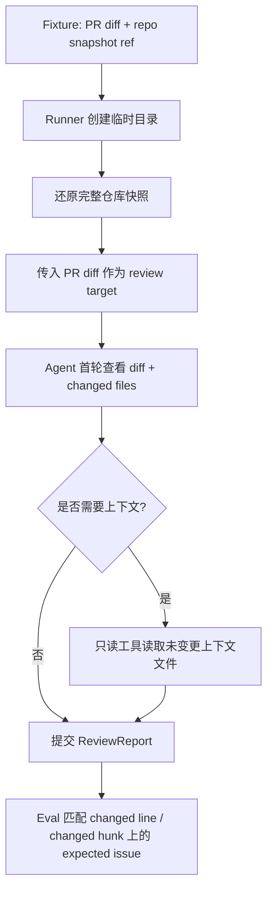

# 健壮 Golden Fixture 构建规范：PR diff + repo snapshot

> 本文定义后续版本更健壮的 review 黄金集形态。目标是让 eval 尽量接近真实 PR review：Agent 面对的是 PR diff，但可在完整仓库快照中按需读取上下文。

## 1. 产品定位

MergeWarden 的 review 能力不负责替代 GitHub CI 判断“能不能合并”。CI / branch protection 仍是硬性合并裁决者；Agent 的职责是补充 CI 不一定覆盖的 reviewer 判断：这段代码虽然可能能过测试，但是否值得怀疑、是否缺少保护、是否引入难以被现有测试捕捉的风险。

因此 review eval 不应演变成全仓库审计。它只考察本次 PR diff 引入、暴露或未修复的问题，并要求 finding 能定位回 changed line 或 changed hunk。

## 2. 目标运行形态



关键约束：

- 初始 prompt 不塞全仓库内容。
- 完整仓库快照只作为工具可访问 workspace。
- `expected.issues` 只标注 diff 相关问题。
- `ReviewIssue.location` 必须落在 changed line 或 changed hunk。
- 未变更文件可以出现在 `evidence` 中，但不能成为默认 inline comment 位置。

## 3. Fixture 数据结构建议

长期建议在现有 `FixtureInput` 外扩展 workspace 元数据，而不是把全仓库内容内嵌进 JSON。

```json
{
  "input": {
    "diff_text": "...",
    "files": {},
    "workspace": {
      "kind": "git",
      "repo_url": "https://github.com/owner/repo.git",
      "base_sha": "abc123",
      "head_sha": "def456",
      "checkout_sha": "def456",
      "diff_base_sha": "abc123"
    }
  }
}
```

字段语义：

- `repo_url`：公开仓库地址，runner 可 clone / fetch。
- `base_sha`：PR base commit，用于明确 diff 基线。
- `head_sha`：PR head commit，用于还原被 review 的代码状态。
- `checkout_sha`：临时 workspace 实际 checkout 的 commit，通常等于 `head_sha`。
- `diff_base_sha`：用于生成或校验 `diff_text` 的基线，通常等于 `base_sha`。

当前 `input.files` 可保留为兼容字段。迁移完成后，review fixture 优先使用 `workspace` 还原完整仓库；`files` 只用于小型单文件单测或离线降级。

## 4. Runner 行为规范

当 fixture 带有 `workspace.kind = "git"` 时，runner 应：

1. 创建临时目录。
2. clone 或使用本地缓存 fetch `repo_url`。
3. checkout `checkout_sha`。
4. 将该目录作为 `ReviewRequest.repo_path`。
5. 将 `diff_text` 作为 `ReviewRequest.diff_text`。
6. 设置 `diff_mode=True`。
7. 保持 review 模式只暴露只读工具。

runner 不应把整个仓库内容拼进 prompt。上下文扩展仍由 agent 通过 `read_file`、`grep_files`、`glob_files`、`list_dir` 按需完成。

## 5. 标注规范

正式 `suite=golden` 的正样本必须满足：

- `metadata.reviewed = true`
- `metadata.annotated_by = "manual"`
- `expected.issues[*].path` 指向 changed file。
- `expected.issues[*].line` / `end_line` 与 PR diff 新文件行号一致。
- 问题能从 changed hunk 直接定位；上下文文件只用于证明为什么它有风险。
- severity 只反映本次 diff 引入的风险，不惩罚历史遗留问题。

负样本应覆盖：

- 纯测试补充。
- 文档或注释变更。
- 安全的重构或重命名。
- 有 reviewer 争议但最终没有可从 diff 直接证明的缺陷。

## 6. 候选来源

候选 PR 可以来自两类：

- `merged-bugfix`：已合并 bugfix PR，用于寻找历史上真实修复过的问题。
- `rejected-pr`：closed but unmerged PR，且维护者、协作者或贡献者在 discussion / review 中指出明确问题。

`rejected-pr` 候选只进入 `golden_candidates`。进入正式 `golden` 前必须人工确认：问题确实由 diff 引入，且 expected location 能落在 changed line / changed hunk。

## 7. 不纳入本规范的目标

- 不做全仓库漏洞扫描黄金集。
- 不要求 agent 运行测试才能命中 expected issue。
- 不把未变更文件上的历史问题标成正样本。
- 不把 Agent 输出定义为用户 PR 的 hard merge block。

## 8. 迁移步骤

1. 当前阶段：优先修正现有正样本，至少保证 changed file 使用完整文件或明确行号映射。
2. 已落地：为 `FixtureInput` 增加可选 `workspace` 元数据，并让 runner 支持 git snapshot checkout。
3. 稳定阶段：将人工审核正样本迁移到 `PR diff + repo snapshot` 形态。
4. 收口阶段：已恢复 `hit_rate >= 0.6` eval gate；持续在报告中区分 schema 失败、未命中、误报和 workspace 还原失败。

## 9. 验收标准

- 同一 fixture 在干净机器上能还原相同 workspace。
- diff hunk 新文件行号与 workspace 文件行号一致。
- Agent 可以通过只读工具读取未变更上下文文件。
- 命中的 issue location 与 expected changed hunk 重叠。
- 无 expected issue 的样本不会因为全仓库历史问题产生高置信误报。
